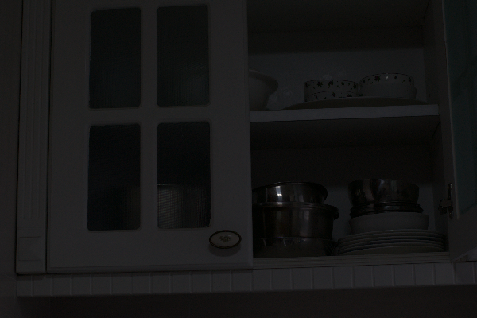

# ✨ Low Light Image Enhancer 🖼 [](https://www.repostatus.org/#active) [](https://prateekralhan.github.io/)

A simple streamlit based webapp to process and enhance low-light images using Keras MIRNet.


## Installation:
* Simply run the command ***pip install -r requirements.txt*** to install the dependencies.

## Usage:
1. Clone this repository and install the dependencies as mentioned above.
2. Simply run the command: 
```
streamlit run app.py
```
3. Navigate to http://localhost:8501 in your web-browser.
4. By default, streamlit allows us to upload files of **max. 200MB**. If you want to have more size for uploading audio files, execute the command :
```
streamlit run app.py --server.maxUploadSize=1028
```


## Results:
| **Original Low-Light Image**  | **Enhanced Image**  |
|--------------------------|-------------------------------------|
|   |   |
|   |   |
|  |  |
|  |  |
|  |  |

### Running the Dockerized App
1. Ensure you have Docker Installed and Setup in your OS (Windows/Mac/Linux). For detailed Instructions, please refer [this.](https://docs.docker.com/engine/install/)
2. Navigate to the folder where you have cloned this repository ( where the ***Dockerfile*** is present ).
3. Build the Docker Image (don't forget the dot!! :smile: ): 
```
docker build -f Dockerfile -t app:latest .
```
4. Run the docker:
```
docker run -p 8501:8501 app:latest
```

This will launch the dockerized app. Navigate to ***http://localhost:8501/*** in your browser to have a look at your application. You can check the status of your all available running dockers by:
```
docker ps
```
